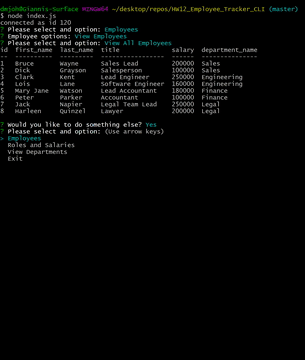

# Employee Tracker

> Simple solution to keep track of employees, departments, roles and salaries of your company.


## Table of Contents

- [Installation](#installation)
- [Usage](#usage)
- [Tests](#tests)
- [Contributing](#contributing)
- [Support](#support)
- [License](#license)

## Installation
- Open your terminal and follow these steps:

> Install the required dependencies

```shell
$ npm install
```

> run the app via node.js

```shell
$ node index.js
```
---
## Demo

Use the app to view, add, remove employees, roles and departments:
 

---
## Usage

- Keep track of your staff with this simple solution.
- View, add, update or remove employees.
- View, add or remove roles and salaries.
- View the company's departments.

---

## Tests

This app was made using the following technologies:
- <a href="https://code.visualstudio.com/" target="_blank">Visual Studio Code</a>
- <a href="https://nodejs.org/en/" target="_blank">Node.js</a>
> npm packages:
- <a href="https://www.npmjs.com/package/dotenv" target="_blank">dotenv</a>
- <a href="https://www.npmjs.com/package/inquirer" target="_blank">Inquirer</a>
- <a href="https://www.npmjs.com/package/mysql" target="_blank">My SQL</a>
- <a href="https://www.npmjs.com/package/console.table" target="_blank">Console.Table</a>

---

## Contributing

> To get started...

### Step 1

- **Option 1**
    - 🍴 Fork this repo!

- **Option 2**
    - 👯 Clone this repo to your local machine using `https://github.com/dmjohnspor/HW12_Employee_Tracker_CLI.git`

### Step 2

- **HACK AWAY!** 🔨🔨🔨

### Step 3

- 🔃 Create a new pull request using `https://github.com/dmjohnspor/HW12_Employee_Tracker_CLI/compare/`

---

## Support

Reach out to me at one of the following places!

- Github at <a href="https://github.com/dmjohnspor" target="_blank">`dmjohnspor`</a>
- LinkedIn at <a href="https://www.linkedin.com/in/ioannis-sporidis-foster" target="_blank">`dmjohnspor`</a>
- Email at dmjohnspor@gmail.com


---

## License


